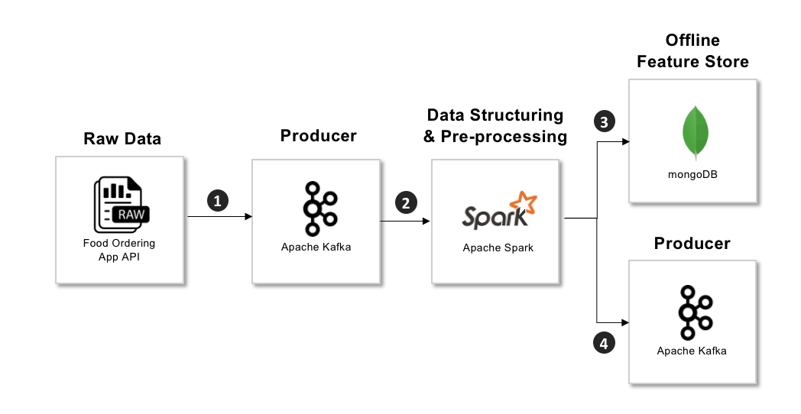

# Stream-Data-Pipeline-With-Kafka-and-Spark

<!-- ABOUT THE PROJECT -->
## About
  
The Kafka distributed messaging system will be the subject of this learning project. A publish-subscribe architecture was developed, where consumers read messages coming from topics that are subscribed and messages are sent via producers. This project involved developing an API that simulates a food ordering system.

#### Step 1: Initialize API that will feed the pipeline

> python generate_data.py 

For every second raw data is sent to the endpoint 'http://0.0.0.0:3030/FoodOrderingApp'

#### Step 2: Start the server, create a topic and push the data to Kafka

Start ZooKeeper server - used apache-zookeeper-3.8.0 version
> bin/zkServer.sh start conf/zoo_sample.cfg

Start Kafka server -used kafka-3.3.1 version
> bin/kafka-server-start.sh config/server.properties

Create a topic named "RawData"
> bin/kafka-console-consumer.sh --bootstrap-server localhost:9092 --topic RawData --from-beginning

Push data from API to Kafka Topic
> python push_data_to_kafka.py

#### Step 3 & 4: Store the data in offline feature store and push the clean data into the new Kafka Topic

> python data_preprocessing.py

<!-- ROADMAP -->
## RoadMap

 * [ ] Containerized each step
 * [ ] Add anonymization API while doing the data preprocessing
 * [ ] Use the clean data from Kafka for a live dashboard (simulate the restaurant when receiving the orders) or add machine learning using this data

(<a href="#readme-top">back to top</a>)

